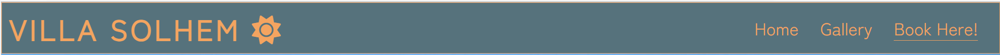
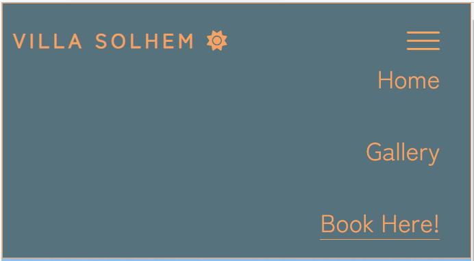

---

# _Villa Solhem_

The Villa Solhem website allows users to learn about the vacation house to rent "Villa Solhem" find information about the facilities, browse through images and make a booking reservation request. The visitors of the website could quickly contact the hosts and announce their interest.

The site can be accessed by this [link](https://johanplar.github.io/villa-solhem/)

---

## User Stories

### First Time Visitor Goals:

- As a First Time Visitor, I want to easily understand the main purpose of the site, so I can learn more about the house to rent.
- As a First Time Visitor, I want to be able to easily navigate through the website, so I can find the content.
- As a First Time Visitor, I want to see inspiring vacation images.

### Returning Visitor Goals:

- As a Returning Visitor, I want to learn about house features, so I can see whether the property matches my vacation needs.
- As a Returning Visitor, I want to learn about things to do close to the rental house, so that I can start planning my vaction activities.
- As a Returning Visitor, I want to learn the best way to travel to the house.
- As a Returning Visitor, I want to find a way to get in contact with the hosts, so that I can ask additional questions or send a booking request.
- As a Returning Visitor, I want to find community links, so that I can learn more about the organization.

### Frequent Visitor Goals:

- As a Frequent User, I want to check whether there are any changes with house features and possible activities, so I can update my vacation plans.
- As a Frequent User, I want to have options to contact the hosts not only through booking requests, so I can get an answer to my email questions.

## Features

- ### Navbar

- ##### Navigation

  - Positioned at the top of the page.
  - Contains logo of the company on the left side.
  - Contains navigation links on the right side:
    - Home - leads to the home page where users can learn about Villa Solhem.
    - Gallery - leads to the gallery page where users can see inspirational vacation photos.
    - Book Here - leads to the booking request form page where users can fill out the form in order to send a booking reservation request.
  - The links have animated hover effect.
  - The navigation is clear and easy to understand for the user.
    

  - The navigation bar is responsive:

    - On tablets and mobile devices: the logo size is still to the left but smaller and a hamburger menu is implemented on the right side of the navigation bar.

      - navigation bar filled with the logo to the left and a hamburger menu implemented on the right side of the navigation bar.  
        

      - When the hamburger menu is clicked, there is dropdown menu with the links in the same order aligned to the right.
        

---

- ### Home Page

  - Represent:

    - the main idea of the vacation house to rent.
    - Emphasize the strong points of the house.
    - Invites to fill out the booking form.

  

---

- #### Hero Section

  - Hero section have a fixed background image.

  - Hero section have a info card placed near the right bottom corner:

    - Motivational text to chose the house the rent.
    - Short description of the area features.
    - Short description of the web page features.

  

---

- #### Vacation Details

  - Vacation Details Section has 2 cards with descriptive characteristics of the house and a button to link to booking page.

  - The Book Now button is animated uppon hovering.

  - Tells website visitors about house features and distance to nearby activities.

  - Icons from Fontawesome added to each feature to add readability and attractivity.

  - Attracts viewers to do a booking reservation.

  

  ***

- #### Map Section

  - The Map Section has an iframe containing a map over Gotland.

  - The map shows a starting and an end point showing the way from the ferry to the vacation house.

  - The map shows the distance between the start and the end point.

​

---

- #### Footer

  - Footer contains email and social media links that open in a new tab.

  

---

- ### Gallery Page

  - Gallery page contains a mosaic of images that aims to inspire a visit.

  - It has a hover function that scales up the image hovered so that the user gets a better look at the images of interest.

  - The photos represent possible vacation experiences at Gotland.

    - The gallery is responsive: the size of the photo depends on the user's screen.

  - It has a footer and nav identical to the home page's.

​

---

- ### Booking page

  - Booking page has a booking request form:

    - All text input fields are customized.

      - All inputs are set to be required to fill out.
      - It has a reset form button to helps users who want to start over.

    - The form has all the neccessary details for an intitial booking request.

      - The submit and the reset button is animated on hover.

    - The page is responsive on all common screen sizes.

    - The submit button leads to the thank you page.

    - It has a footer and nav identical to the home page's.

  ​
  

---

- ### Thank You page

  - The Thank You Response page appears after submitting the booking form.
  - It contains the thank you message and the promise to get in touch with the applicant.
  - It will automatically direct the user to the main page in 15 seconds.

  - It has a footer and nav identical to the home page's.

  

---

## Technologies Used

- [HTML](https://developer.mozilla.org/en-US/docs/Web/HTML) was used as the foundation of the site.
- [CSS](https://developer.mozilla.org/en-US/docs/Web/css) - was used to add the styles and layout of the site.
- [CSS Flexbox](https://developer.mozilla.org/en-US/docs/Web/CSS/CSS_flexible_box_layout) - was used to arrange items simmetrically on the pages.
- [CSS Grid](https://developer.mozilla.org/en-US/docs/Web/CSS/grid) - was used to make "gallery" page responsive.
- [CSS roots](https://developer.mozilla.org/en-US/docs/Web/CSS/:root) was used to declaring global CSS variables and apply them throughout the project.
- [Balsamiq](https://balsamiq.com/) was used to make wireframes for the website.
- [Codeanywhere](https://app.codeanywhere.com/) was used as the main tool to write and edit code.
- [Git](https://git-scm.com/) was used for the version control of the website.
- [GitHub](https://github.com/) was used to host the code of the website.
- [Website Mockup Generator](https://websitemockupgenerator.com/) Was used to create the responsive Mockup png for Readme file visualisation.
- [ezgif](https://ezgif.com/) Was used to create gif animations for Readme file visualisation.

---

## Design

### Color Scheme

- Blue color was used as the main color of the website to represent the evening the ocean.

- Light Blue Color was used as a contrast to the darker blue to resemble clear blue mid day sky.

- Sandybrown is used as a contrast color and was picked from the setting sun present in the hero-image and used as font-color.

- Limestone white was picked to represent the limestone house colors of Villa Solhem also present at the many Gotland beaches.

### Typography

- Zen Kaku Gothic Antique was used as the main font and Logo text of the website in order to increase readability.

- IBM Plex Serif was used to contrast headlines on cards from the main font to accentuate info cards.

### Wireframes

#### Mobile devices

- [Home Page. Mobile Screen](documentation/mobile-home-page.png)
- [Gallery Page. Mobile Screen](documentation/mobile-gallery-page.png)
- [Booking Page. Mobile Screen](documentation/mobile-booking-page.png)
- [Thank You Page. Mobile Screen](documentation/mobile-thank-you-page.png)

#### Tablets

- [Home Page. Tablet Screen](documentation/tablet_home_page.png)
- [Gallery Page. Tablet Screen](documentation/tablet-gallery-page.png)
- [Booking Page. Tablet Screen](documentation/tablet-booking-page.png)
- [Thank You Page. Tablet Screen](documentation/tablet-thank-you-page.png)

#### Desktop

- [Home Page. Desktop Screen](documentation/desktop-home-page.png)
- [Gallery Page. Desktop Screen](documentation/desktop-gallery-page.png)
- [Booking Page. Desktop Screen](documentation/desktop-booking-page.png)
- [Thank You Page. Desktop Screen](documentation/desktop-thank-you-page.png)

---

## Testing

In order to confirm the correct functionality, responsiveness, and appearance:

- The website was tested on the following browsers: Chrome, Firefox, Edge.

  - Chrome:

  

  - FireFox:

  

  - Edge:

  

- The website was checked by devtools implemented in Edge and Chrome browsers.

  - Main Page:

  

  - Gallery Page:

  

  - Booking Page:

  

  - Thank You Page:

  

* The website was checked with [Responsive Website Design Tester](https://responsivedesignchecker.com/).

  - Desktop Screens:
    
    
    
    
    
    
    
    

  - Tablet Screens:
    
    
    
      
    

  - Mobile Screens:

  
  
  
  
  
  
  

- The functionality of the links in the website was checked as well by different users.

### Manual testing

| feature                            | action                                                                      | expected result                              | tested | passed | comments                                                                                                              |
| ---------------------------------- | --------------------------------------------------------------------------- | -------------------------------------------- | ------ | ------ | --------------------------------------------------------------------------------------------------------------------- |
| Navbar                             |                                                                             |                                              |        |        |                                                                                                                       |
| Home                               | Click on the "Home" link                                                    | The user is redirected to the main page      | Yes    | Yes    | -                                                                                                                     |
| Gallery                            | Click on the "Gallery" link                                                 | The user is redirected to the gallery page   | Yes    | Yes    | -                                                                                                                     |
| Contact                            | Click on the "Book!" link                                                   | The user is redirected to the booking page   | Yes    | Yes    | -                                                                                                                     |
| Footer                             |                                                                             |                                              |        |        |                                                                                                                       |
| Email icon in the footer           | Click on the Email icon                                                     | The user activates the mailto feature        | Yes    | Yes    | -                                                                                                                     |
| Instagram icon in the footer       | Click on the Instagram icon                                                 | The user is redirected to the Instagram page | Yes    | Yes    | -                                                                                                                     |
|                                    |
| Facebook icon in the footer        | Click on the Facebook icon                                                  | The user is redirected to the Facebook page  | Yes    | Yes    | -                                                                                                                     |
| Twitter icon in the footer         | Click on the Twitter icon                                                   | The user is redirected to the Twitter page   | Yes    | Yes    | -                                                                                                                     |
| Home page                          |                                                                             |                                              |        |        |                                                                                                                       |
| "Book Now!" button in Main section | Click on the "Book Now!" button                                             | The user is redirected to the booking page   | Yes    | Yes    | -                                                                                                                     |
| Gallery page                       |                                                                             |                                              |        |        |                                                                                                                       |
| Image in the gallery               | User hover the image                                                        | Image scales for better visibility           | Yes    | Yes    | -                                                                                                                     |
| Bookig page                        |                                                                             |                                              |        |        |                                                                                                                       |
| Arrival                            | Enter arrival date                                                          | The arrival date is entered                  | Yes    | Yes    | If user doesn't enter arrival date, the error message appears                                                         |
| Departure                          | Enter arrival date                                                          | The departure date is entered                | Yes    | Yes    | If user doesn't enter departure date, the error message appears                                                       |
| First name input                   | Enter the first name                                                        | The first name is entered                    | Yes    | Yes    | If user doesn't enter the first name, the error message appears                                                       |
| Last name input                    | Enter the last name                                                         | The last name is entered                     | Yes    | Yes    | If user doesn't enter the last name, the error message appears                                                        |
| Visitors                           | Enter number of visitors                                                    | Number of visitors is entered                | Yes    | Yes    | If uder does'nt enter number of visistors, the error message appears                                                  |
| Email input                        | Enter the email                                                             | The email is entered                         | Yes    | Yes    | If user doesn't enter the email, the error message appears. If user enters not valid email, the error message appears |
| Phone Number                       | Enter the phone number                                                      | The phone number is entered                  | Yes    | Yes    | If user doesn't enter the phone number, the error message appears                                                     |
| "Reset" button                     | Click on the "Reset" button                                                 | The entered form values resets               | Yes    | Yes    | -                                                                                                                     |
| "Submit" button                    | Click on the "Submit" button                                                | The user is redirected to the thank you page | Yes    | Yes    | -                                                                                                                     |
| Thank you page                     |                                                                             |                                              |        |        |                                                                                                                       |
| Response message                   | The user will be automatically redirected to the home page after 15 seconds | The user is redirected to the home page      | Yes    | Yes    | -                                                                                                                     |

### Bugs

- ##### Solved bugs

  1. 

  ***

- ##### Unsolved bugs
  - None.
- ##### Mistakes
  -
---

## Validator testing

- ### HTML

  #### Home Page

  - No errors or warnings were found when passing through the official W3C validator.

  

  #### Gallery Page

  - No errors or warnings were found when passing through the official W3C validator.

  

  #### Booking Page

  - No errors or warnings were found when passing through the official W3C validator.

  

  #### Thank You Page

  - No errors or warnings were found when passing through the official W3C validator.

  

- ### CSS

  No errors or warnings were found when passing through the official W3C (Jigsaw) validator except:
  

  - 8 warnings regarding the use of _:root variables_: "Due to their dynamic nature, CSS variables are currently not statically checked".

  

  + ### Accessibility and performance 
    - Using lighthouse in devtools I confirmed that the website is performing well, accessible and colors and fonts chosen are readable.
    
  #### Home page

  

  #### Gallery page

  

  #### Contact page

  

  #### Response page

  

---

* #### Content

  - Inspiration for the gallery hover effect came from the article "How to add a gradient to overlay to a background image using just CSS and HTML" published the website [Web Dev etc](https://webdevetc.com).
  - Inspiration for the responsive hamburger navbar came from [Kevin Powell](https://www.youtube.com/user/KepowOb) on his YouTube channel.

* #### Media

  - [Hero image and Main Section image on homepage](Private photo: Johan Plym Arkert);

  * All the rest of the images for the website were taken from [Pixabay](https://pixabay.com/).

  - Gallery Page:

    - [1st image](https://pixabay.com/photos/sweden-gotland-blue-sky-clouds-3960965);
    - [2nd image](https://pixabay.com/photos/bike-gotland-high-cliff-mtb-see-1068495);
    - [3rd image](https://pixabay.com/photos/port-coastal-gotland-3742871);
    - [4th image](https://pixabay.com/photos/gotland-tofta-high-cliff-run-1068498);
    - [5th image](https://pixabay.com/photos/gotland-sheep-island-sea-stack-sea-644589);
    - [6th image](https://pixabay.com/photos/house-meadow-rural-village-5839811);
    - [7th image](https://pixabay.com/photos/the-gotland-ferry-gotland-summer-1202114);
    - [8th image](https://pixabay.com/photos/get-bagge-agriculture-animals-horn-2789828);
    - [9th image](https://pixabay.com/photos/sunset-gotland-summer-sweden-4227191);
    - [10th image](https://pixabay.com/photos/vassrugge-sand-dune-beach-gotland-655475);
    - [11th image](https://pixabay.com/photos/gotland-sea-slite-sky-644597);
    - [12th image](https://pixabay.com/photos/visby-gotland-visby-cathedral-644588).

  - Booking and Thank You Page:
    - [Background image](https://pixabay.com/photos/stone-tower-gotland-zen-meditation-1995051).

* #### Tools

  - [EzGif](https://ezgif.com) was used to resize GIF images.
  - [cooler](https://coolors.co/) was used to create the color palette.
  - [mockupGen](https://websitemockupgenerator.com/) was used for responsive mockup png.
